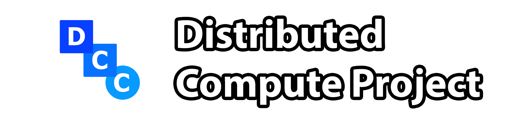

[![Badge License]][License]   [![Button Discord]][Discord Server]      [![Badge Blockchain]][Blockchain]

 

A unique P2P blockchain built in C++, with a trading client and a miner. This crypto can be bought, traded, sold, mined, or used just like any other. What sets it apart though is how it can be used, and the technique for mining. It is based on sharing mining computing hardware with developers to run their programs better and compute a large amount of data quickly, using Distributed Computing. Anybody can submit code using the client to be run across the peer-to-peer network, and will pay for that using this crypto. [What sets this crypto apart?](./#condensing).

 

# Condensing

The idea of the Distributed Computing Network likely seems a little backwards to begin with. *Why use your computer to run others' programs to save up DCC to run your own, when you can just run it on your own PC?* The answer to this is simple: when you use and run DCC, it is **not** an exchange. Rather, it is a ***condensing*** of your computing power, to be used on-demand at a later date.

Most of the worlds computers run at a capacity far below their maximum, because of *idling*. When you are not running your program, your computer has nothing to do, right? And you only utilize that maximum it can reach sparsely, when you need something more demanding done. So most of the time, the power of your computer goes to waste.

Instead of allowing this to happen, DCC allows you to **condense** this idle computing time (***condensing** is comparable to mining in other cryptocurrencies*), storing it physically in the form of DCC$, and letting you use it at a later time to exhert far more computing power than you could originally utilize, in far lower time.

With this system, each client will receive an amount of DCC$ proportionally to their hardware, and more efficiently utilize hardware world-wide. Imagine an Artificial Intelligence model, that can be trained an equivilant of centuries in a matter of 5 minutes. Or protein folding and other medical computations. Or an accurate simulation of atoms, to a macroscopic scale. Or the simulation of a brain.

Supercomputers are expensive to build, and equally as expensive for institutions to rent. Distributed Supercomputing is far cheaper, and actually contains enough power to out-compete even the best supercomputers. Although it has existed for some time, most implementations are through the process of volunteering, and a centralized developer and goal. DCC will bring supercomputing to the people, for a low price.

 

# Installation

Currently only Linux is directly supported. Go to the **[Installation Page]** to see how to install, or build it if your platform is not supported.

 

<!----------------------------------------------------------------------------->

[Installation Page]: ./docs/Installation.html
[Blockchain]: ./tools/Blockchain_Viewer.html

[License]: LICENSE
[Discord Server]: https://discord.gg/9p82dTEdkN

<!----------------------------------[ Badges ]--------------------------------->

[Badge License]: https://img.shields.io/badge/license-DCP--GPL-brightgreen
[Badge Blockchain]: https://img.shields.io/badge/blockchain_length-0_blocks-blue

<!---------------------------------[ Buttons ]--------------------------------->

[Button Documentation]: https://img.shields.io/badge/Documentation-008FC7?style=flat-square&logoColor=white&logo=GitBook
[Button Video]: https://img.shields.io/badge/Video-c91111?style=flat-square&logoColor=white&logo=YouTube
[Button Discord]: https://img.shields.io/badge/Discord_Server-573f75.svg?style=social&logo=Discord
